# Village – 3D Grid System

A cozy, grid-based village building game made in Unity 6.
Shape your island block by block, chop trees, build structures from logs, sail a boat and play with a cat, all with a hand-shaped glove cursor.

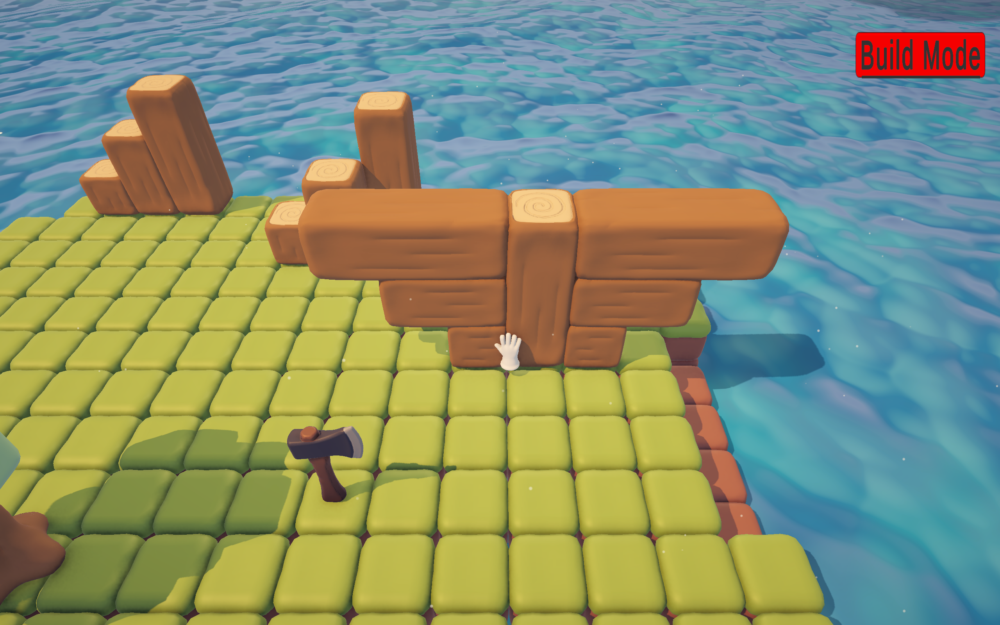

> 🇯🇵 日本語の説明は[下記](#日本語)をご覧ください。

---

## 🌍 3D Grid World

The whole world is built on a layered 3D grid. Every block and object occupies grid cells, and ground blocks and objects placed on top of them are managed separately.
In **Build Mode** you can place and remove ground blocks on any layer to shape your own island, and place objects such as trees, tools, the cat and the boat. The whole world is saved and restored.

You interact with everything through a **glove cursor**: a hand that picks up, carries, rotates and uses objects.

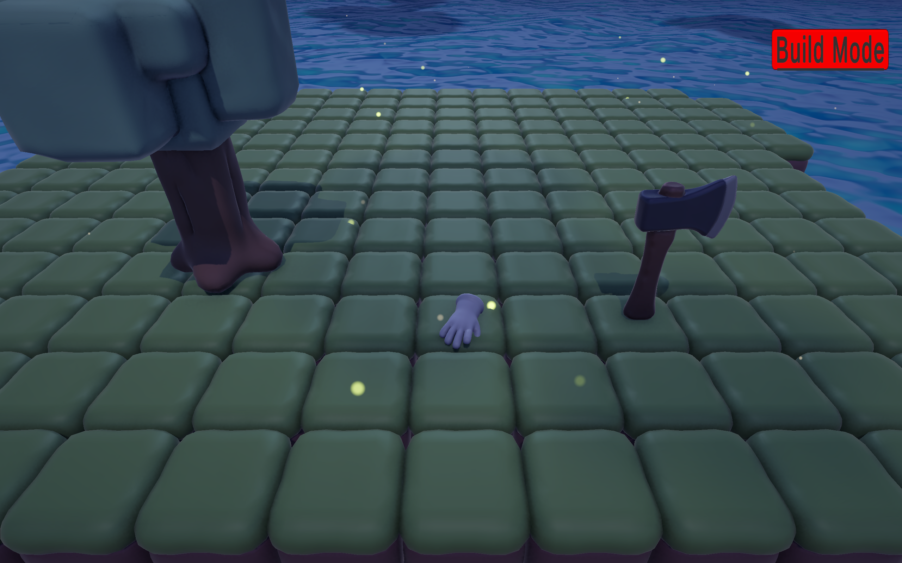

---

## 🪓 Tree Chopping

Pick up the axe with the glove and chop a tree. The tree reacts to every hit, falls down and turns into logs you can carry.

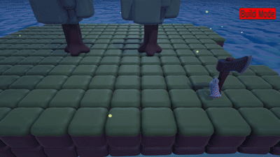

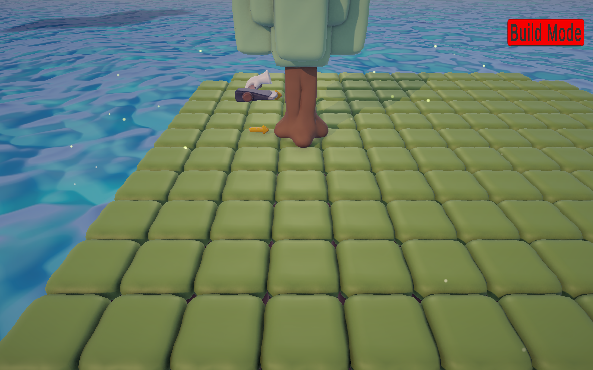

---

## 📐 Blueprints

Choose a blueprint and place it on the island. It appears as a transparent outline of the structure you are going to build.

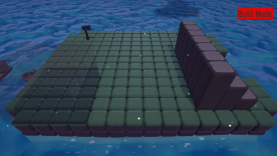

---

## 🪵 Building with Logs

Logs can be connected to each other's sides and tops to create larger shapes. Fill the blueprint by placing the right pieces into it; a matching piece snaps into place, and when every part is filled the structure is complete.
Blueprints can also be created with a custom editor tool.

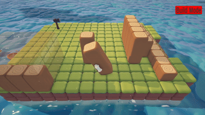

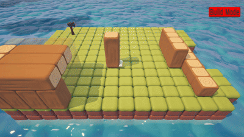

| | |
|---|---|
| 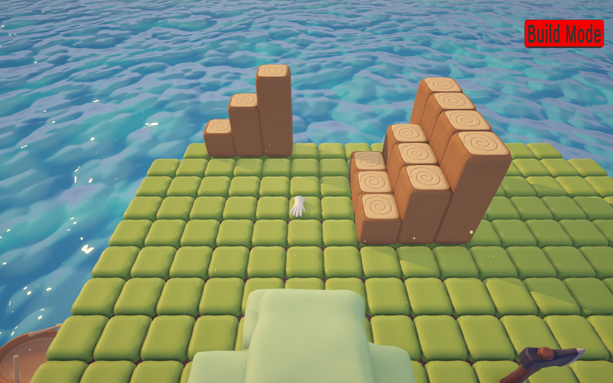 | 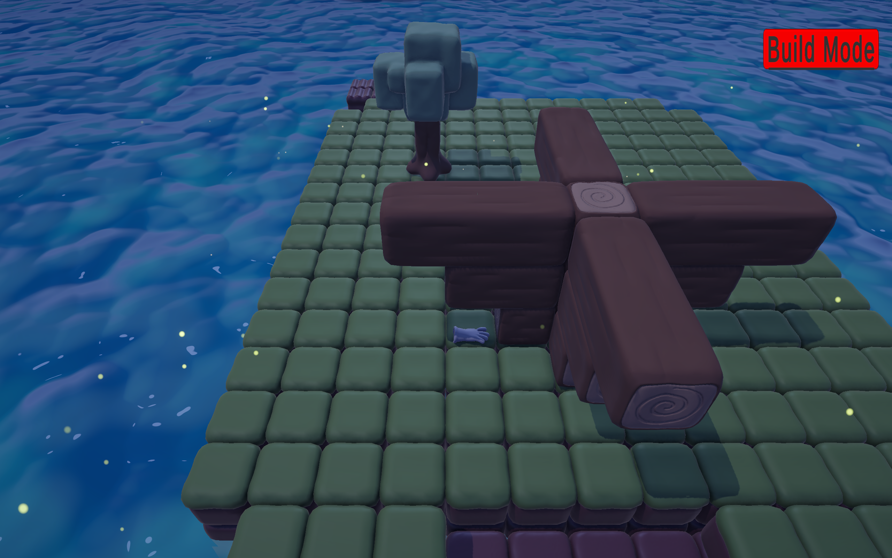 |

---

## 🐱 Cat

A cat lives on the island. It wanders around, sits and sleeps on the grid, and reacts to the glove: you can pet its head, rub its belly, and it gets annoyed if you overdo it.

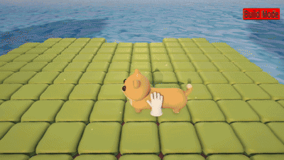

The cat also notices the glove and plays with it, sneaking up and chasing it around.

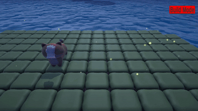

---

## ⛵ Boat & Floating Farm

Jump on the boat and sail across the water. The boat tows a floating farm behind it, and farm pieces can be placed onto it.

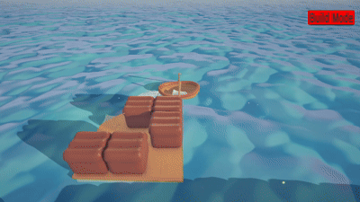

| | |
|---|---|
| 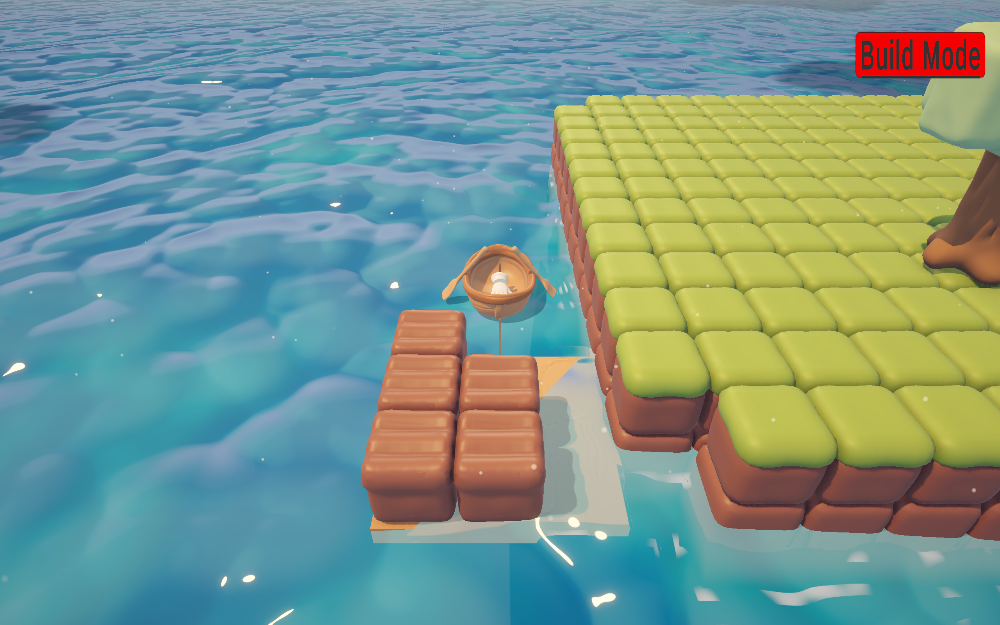 | 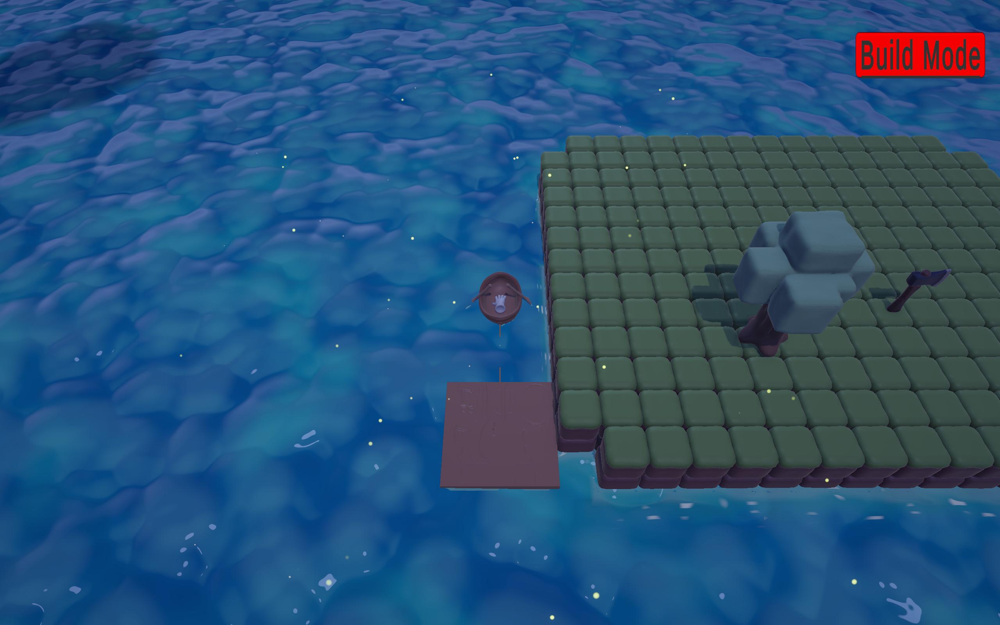 |

---

## ✨ Atmosphere

- Day–night cycle with changing light, sky and water colors
- Stylized water, wind, cloud shadows, pollen and fireflies
- Soft, squishy deformation on objects and creatures

---

## 🎮 Controls

| Key | Action |
|---|---|
| Mouse | Move the glove, pick up and use objects |
| R | Rotate the held object |
| Q / E | Rotate the camera |
| WASD | Move the camera / steer the boat |
| Mouse wheel | Zoom |
| F5 | Save |

## 🛠 Tech Stack

Unity 6 (6000.3.11f1) / URP · C# · HLSL · Input System · Blender

## 🚀 Getting Started

1. Clone the repository
   ```
   git clone https://github.com/MertOzzencir/3D-Grid-System.git
   ```
2. Open Unity Hub → **Add** → select the `Village` folder
3. Open the project with Unity **6000.3.11f1**

## 🤖 Development

Game design, direction, 3D models and testing by me. The code was written together with **Claude Code** as an AI pair programmer.
Design notes: [`DESIGN.md`](DESIGN.md) · Technical rules: [`CLAUDE.md`](CLAUDE.md) (both in Turkish)

## Author

**Mert Özzencir** · [@MertOzzencir](https://github.com/MertOzzencir)

---

## 日本語

Unity 6で開発している、グリッドベースのまったり系村づくりゲームです。
手袋型のカーソルで、ブロックを置いて島を作り、木を切り、丸太で建物を作り、ボートで海を渡り、猫と遊びます。

### 主な機能

- **3Dグリッドワールド**：階層構造の3Dグリッド上にすべてのオブジェクトを配置。ビルドモードでブロックを置いたり消したりして、自由に島を作成。ワールド全体のセーブ・ロード
- **手袋カーソル**：オブジェクトを持ち上げる・運ぶ・回転させる・使う
- **木こり**：斧で木を切ると、木が倒れて持ち運べる丸太になる
- **設計図（ブループリント）**：設計図を選んで島に置くと、建てる建物が半透明で表示される
- **丸太の組み立て**：丸太の側面や上に別の丸太をつなげて形を作り、設計図を埋めて建物を完成させる。設計図を作るエディタツールも制作
- **猫**：島を歩き回り、座ったり寝たりする猫。頭をなでる・お腹をさするなどに反応し、手袋を追いかけて遊ぶ
- **ボートと浮かぶ畑**：ボートに乗って水上を移動。後ろに浮かぶ畑を引っ張り、畑のパーツを載せられる
- **雰囲気づくり**：昼夜サイクル、スタイライズドな水、風、雲の影、ホタル、ぷるぷるした変形表現

### 使用技術

Unity 6 (URP) / C# / HLSL / Input System / Blender

### 開発について

ゲームデザイン・方向性・3Dモデル・テストは自分で担当し、コードはAIペアプログラマーとして **Claude Code** と一緒に書きました。

### 開発者

メルト・オッゼンジル
